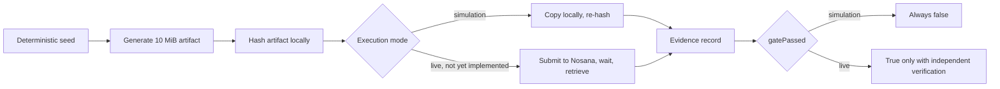

# Nosana Adapter Foundry


Nosana Adapter Foundry is an open prototype for turning a small dataset into a
verified, versioned training and inference workload on the Nosana GPU
network. This repository contains Gate 1: a small, self-contained check of
whether a deterministic artifact can survive a Nosana job round trip byte for
byte, with an evidence record that distinguishes a real result from a
rehearsal.

## The problem

Decentralized GPU networks remove a layer of infrastructure trust that
centralized providers normally absorb. Before a training or inference
pipeline is built on top of one, three questions need concrete answers, not
assumptions:

- Does a submitted job actually complete and return usable output.
- Can the resulting artifact be retrieved intact, with a hash to prove it.
- What does the CLI and SDK actually support today, as opposed to what the
  documentation implies.

Gate 1 exists to answer those questions for one narrow case (a small,
deterministic binary artifact) before any model training work is attempted on
top of the same infrastructure.

## Current status

**Prototype. Gate 1 has not passed. No live Nosana job has been submitted.**

Everything in this repository runs in simulation mode. Simulation exercises
the same generation, hashing, and evidence logic that a live run would use,
entirely on the local machine, with no network call to Nosana and no cost.
A simulation evidence record is permanently marked
`"executionMode": "simulation"` and its schema makes `"gatePassed": true`
structurally impossible to produce outside a live, independently verified
run. See `src/evidence/job-evidence.ts`.

**A passing simulation is not a passing Nosana gate.** Treat every claim in
this repository as scoped to the local machine until `docs/nosana-cli-findings.md`
and `docs/gate1-assumptions.md` say otherwise.

| Component | Status |
|---|---|
| Deterministic artifact generator | Implemented, tested locally |
| Evidence schema (simulation vs. live) | Implemented, tested locally |
| Secret linter for job definitions | Implemented, tested locally |
| Job definition | Passes `nosana job validate` |
| Live job submission | Not implemented (see blocker below) |
| Artifact retrieval from a completed job | Not confirmed possible with the installed CLI |

## What Gate 1 tests

Gate 1 generates a 10 MiB artifact from a fixed public seed, using a
deterministic SHA-256-based generator so the same seed always produces the
same bytes on any machine. In simulation mode, the artifact is written,
copied, and re-hashed locally to exercise the full generation, hashing, and
evidence pipeline. A live run would replace the local copy step with an
actual Nosana job: submit the job, wait for completion, retrieve the result,
and compare its hash against the value computed before submission.



Gate 1 does not test model training, GPU correctness, confidentiality,
preemption recovery, or checkpoint durability. It tests one thing: whether a
known artifact goes in and the same artifact comes out.

## Installation and verification

Requires Node.js 22.6 or newer.

```bash
git clone https://github.com/satyawansinghinuk-stack/nosana-adapter-foundry.git
cd nosana-adapter-foundry
npm install
npm test
npm run gate1:validate-job
npm run gate1:simulate
```

`npm test` runs the unit and schema tests. `npm run gate1:validate-job`
checks the job definition against the official Nosana CLI validator.
`npm run gate1:simulate` runs the full local pipeline and writes an evidence
file to `evidence/`. None of these three commands submit a job, spend NOS or
SOL, or require a wallet.

A fourth command, `npm run gate1:live-dry-run`, prints the exact `nosana`
CLI command a live run would use and the computed cost ceiling, without
executing it. It requires market parameters as environment variables and
still does not touch the network.

## Confirmed Nosana CLI blocker

Reading the installed `@nosana/cli` 1.0.133 source directly (see
`docs/nosana-cli-findings.md` for exact file and line references) found that
`-o/--output` on `nosana job post` is not implemented in this version. It
throws `artifact support coming soon!` and returns immediately. The CLI's
only working artifact auto-detection path requires a job definition
convention this project does not currently have a way to satisfy without a
third-party pinning credential.

**As of this CLI version, there is no confirmed, working mechanism to
retrieve Gate 1's artifact back from a completed job.** This is the leading
reason a live run has not been attempted. `docs/nosana-cli-findings.md` has
the full investigation, and `docs/dependency-risk.md` covers what `npm audit`
reports for the packages a live submission would exercise.

## Roadmap

1. **Supported live artifact round trip.** Resolve or work around the
   artifact-egress blocker above, then run and verify a real Gate 1 job on
   Nosana with independently fetched job state.
2. **GPU inference adapter.** Deploy a minimal inference workload on Nosana
   once artifact retrieval is confirmed working end to end.
3. **Evaluation and parameter-efficient fine-tuning adapter.** Add a small
   QLoRA or comparable fine-tuning job, plus a base-model-versus-adapter
   evaluation, on top of the same verified infrastructure.
4. **Public developer release.** Package the verified pieces into a
   documented, reusable tool once the above milestones hold up under real
   use.

No dates are attached to these milestones. Each one starts only after the
previous one is verified, not assumed.

## Repository structure

```
src/
  cli/                    Entry points (simulation runner, live dry-run printer)
  generator/               Deterministic artifact generator
  hashing/                  Streaming SHA-256 and canonical JSON hashing
  evidence/                 Evidence schema and validation
  security/                 Secret linter for job definitions
  nosana/
    job-definitions/        The Gate 1 job definition
    dry-run.ts               Builds (never executes) the live Nosana command
containers/
  gate1-artifact-roundtrip/ Container image source for a live run
test/                      Unit and schema tests
docs/
  gate1-assumptions.md      What is verified, inferred, or still unknown
  nosana-cli-findings.md    Source-level investigation of the installed CLI
  dependency-risk.md        npm audit findings and their reachability
evidence/
  gate1-simulation.json     One canonical example evidence record
```

## Security guidance

Nosana job definitions are public by default. Nothing sensitive belongs in
`src/nosana/job-definitions/`, in a test fixture, or in any file tracked by
this repository:

- No wallet file, private key, or seed phrase.
- No API token, access token, or bearer credential.
- No `.env` file. Use `.env.example` as a template and keep the real `.env`
  local and untracked.

`src/security/secret-lint.ts` checks job definitions for common credential
shapes (Solana keypair arrays, base58 secret key material, JWTs, GitHub and
Hugging Face tokens, AWS access keys, bearer tokens) before a job is
submitted, and both `npm test` and `npm run gate1:simulate` exercise it. It
is a best-effort check, not a substitute for reviewing what you are about to
submit. See `SECURITY.md` for how to report a vulnerability or a leaked
credential.

## Team

- **Satyawan Singh**, Project Lead and Engineering. System architecture,
  implementation, Nosana integration, AI workload adapters, and technical
  documentation.
- **Naina**, Cybersecurity. Threat-boundary review, secret-handling review,
  public job-definition safety, dependency exposure, and evidence integrity.
- **Naveen Chirumamilla**, QA Automation. Test planning, automated regression
  coverage, acceptance-gate validation, and reproducibility testing.

## Contributing

See `CONTRIBUTING.md`. In short: read `docs/gate1-assumptions.md` first, run
the four verification commands before and after your change, never commit a
credential, and never present simulation output as a live result.

## Limitations

- No live Nosana job has been submitted. Every number, hash, and job state
  in this repository comes from a local simulation.
- Artifact retrieval from a completed job is not confirmed to work with the
  installed CLI version. See the blocker section above.
- The container image referenced by the job definition has not been built
  or published from this repository.
- Dependency vulnerabilities exist in `@nosana/cli`'s own dependency tree.
  None are known to be reachable through the commands this project currently
  runs (`validate`, `--simulate`); several would become reachable the moment
  a live job is posted. See `docs/dependency-risk.md`.
- This project has not been tested on Node.js 25. The Docker image pins an
  exact Node 22 version and is unaffected; the plain npm scripts have only
  been verified on Node 22.19.0.
- CI does not run `npm run gate1:validate-job`, because the installed
  Nosana CLI performs a live network call to the npm registry on every
  invocation and can fail for reasons unrelated to the job definition's own
  validity. Run that command locally before merging a change to the job
  definition.

## License

Apache License 2.0. See `LICENSE`.
